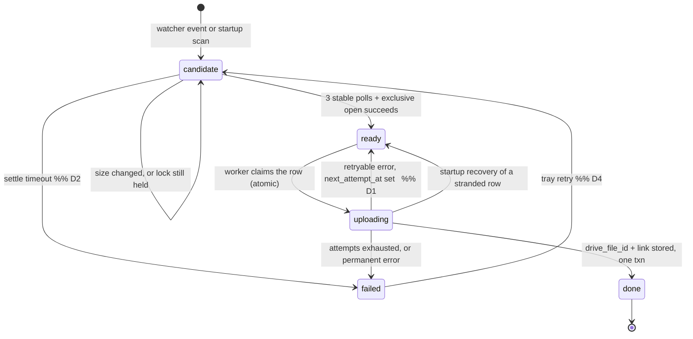

# Clip Auto-Upload — Implementation Plan

Derived from **Route B — Implementation Blueprint** (2026-09-16). The blueprint is the source of truth for architecture, the state table, the roadblock list and the phase order. This document does not change any of that. It translates it into the concrete code we are going to write, and it marks every place where I had to choose something the blueprint left open.

Three kinds of statement appear below, and they are labelled:

- **From the blueprint** — restated, not reinterpreted.
- **Implementation choice** — a mechanism the blueprint requires but does not specify. I give a recommendation. These are safe to accept silently.
- **⚠ Needs your decision** — a choice that changes the schema or a state transition, so it should be settled before Phase 2 code exists. Collected in §7.

---

## 1. Overall system operation

### 1.1 The one-sentence version

A clip is a row in a SQLite table. Five components each own one step of moving that row forward, and none of them call each other — they communicate only by writing a `state` value and reading it back.

### 1.2 The full path of one clip

| # | What happens in the world | What happens in the app |
|---|---|---|
| 1 | You press the ShadowPlay hotkey mid-game. NVIDIA creates `Game Name/Clip 2026.09.16 - 21.03.11.mp4` immediately, then spends seconds to minutes flushing the replay buffer into it. | Nothing yet. |
| 2 | The file appears on disk. | `watchdog` fires a create event (and several modify events). **Watcher** inserts one row: `path`, `state='candidate'`. It does not stat, open or read the file. |
| 3 | NVIDIA is still writing. | **Settle checker** polls every 2s. Size keeps growing → it writes the new `size_bytes`/`mtime`, resets the stable counter, leaves the row at `candidate`. |
| 4 | NVIDIA finishes and releases the handle. | Size unchanged for 3 consecutive polls **and** an exclusive open succeeds → row becomes `ready`. Both tests, not either. |
| 5 | — | **Upload worker** claims a `ready` row (claim-and-mark in one transaction), flips it to `uploading`, opens a resumable Drive session, writes the session URI to the row *before* the first chunk, then streams 8–32 MB chunks. |
| 6 | — | Success → `drive_file_id` + `drive_link` + `state='done'` in one transaction. Failure → `attempts++`, `last_error`, then backed-off retry or `failed`. |
| 7 | You open Drive on your phone. | The clip is in the app-created "Game Clips" folder. |

Throughout, the **Tray UI** runs a grouped count query on a timer and renders it. It writes exactly one thing: a retry reset on a `failed` row.

The **Reconciler** is outside that sequence. It runs **once at startup, to completion, before the watcher is armed**, walks the clips folder recursively, and inserts a `candidate` row for every `.mp4` whose path is not already in the table. Rows already at `done` are skipped. That single pass is the entire reason closing the app is safe.

### 1.3 What runs concurrently

| Loop | Thread | Cadence | Queries it owns |
|---|---|---|---|
| Watcher event callback | `watchdog` observer thread | Event-driven | — (insert only) |
| Settle poll | 1 worker thread | Every 2s | `state='candidate'` |
| Upload worker | 1–2 worker threads | Continuous drain | `state='ready'` |
| Tray refresh | Main thread (pystray owns it) | Every 2–3s | `GROUP BY state` |

Four loops, one process. A clip can be settling while another uploads and a third is already `done`, because each loop only ever queries the states it owns. They never call each other and never share objects — the database row is the only channel.

### 1.4 The invariant

**The queue is the source of truth, not the folder.** The filesystem is read in exactly two places — the watcher's events and the reconciler's startup scan — and both of them can only ever produce a `candidate` row. Every other decision in the app is a query against the state table.

If you are ever tempted to write `os.listdir` into a third place, that is the bug.

---

## 2. Coding architecture

### 2.1 File layout

```
clipsync/
  __init__.py
  main.py          # process entry: config → db → reconcile → arm loops → tray
  config.py        # load/validate the config file (Phase 3; a constants module until then)
  db.py            # owns the schema, the connections, and every SQL statement
  watcher.py       # Watcher
  settle.py        # Settle checker
  reconciler.py    # Reconciler
  uploader.py      # Upload worker
  drive.py         # thin Drive client: auth + create folder + resumable upload
  tray.py          # Tray UI
  logging_setup.py # structured logs + hourly RSS line (Phase 3)
tests/
  test_settle.py   # the one the blueprint singles out
  test_db.py
  test_uploader.py
  test_reconciler.py
```

**Implementation choice:** `drive.py` exists as a separate file. The blueprint explicitly allows this ("Drive access can live in this module or in a thin client beside it. That is a file-layout choice, not a sixth component"). Splitting it is what makes the upload worker unit-testable against a fake, so it earns its place. It is *not* a sixth component: it holds no state, reads no rows, and is called only by `uploader.py`.

### 2.2 The dependency rule

```
main.py ──> every module
watcher.py    ──> db.py
settle.py     ──> db.py
reconciler.py ──> db.py
uploader.py   ──> db.py, drive.py
tray.py       ──> db.py
drive.py      ──> (google libs only)
db.py         ──> (sqlite3 only)
```

No component imports another component. `db.py` imports nothing of ours. If an import edge appears that is not on that list, the architecture has been violated.

### 2.3 `db.py` — the contract

This is the most important module and the one to write first in Phase 2. **No SQL exists anywhere else in the codebase.** Every component calls a named function; the function name *is* the state transition.

#### Schema

```sql
CREATE TABLE IF NOT EXISTS clips (
  id              INTEGER PRIMARY KEY,
  path            TEXT    NOT NULL UNIQUE,   -- normalised; the duplicate guard
  size_bytes      INTEGER,
  mtime           REAL,
  content_hash    TEXT,                      -- optional; see §7
  state           TEXT    NOT NULL CHECK (state IN
                          ('candidate','ready','uploading','done','failed')),
  stable_count    INTEGER NOT NULL DEFAULT 0,  -- see note below
  first_seen_at   REAL    NOT NULL,            -- see note below
  attempts        INTEGER NOT NULL DEFAULT 0,
  last_error      TEXT,
  next_attempt_at REAL,                        -- see note below
  session_uri     TEXT,                        -- required by roadblock 5
  drive_file_id   TEXT,
  drive_link      TEXT,
  updated_at      REAL    NOT NULL
);
CREATE INDEX IF NOT EXISTS ix_clips_state ON clips(state);
```

**On the columns beyond the blueprint's list.** The blueprint already establishes the precedent: it names `session_uri` as "required by the roadblock list but not named in that table" and says to add it. The same reasoning produces three more, each traceable to a stated requirement:

| Column | The requirement it serves | Blueprint reference |
|---|---|---|
| `session_uri` | Resume must survive an app restart, not just a retry | Roadblock 5; §2 "One column is required…" |
| `stable_count` | "size unchanged for 3 consecutive polls" — the counter has to live somewhere | §7 open decision: "Where the consecutive-unchanged counter lives" |
| `first_seen_at` | "Add a hard timeout so a stuck file leaves `candidate`" — needs a start time | Roadblock 1 |
| `next_attempt_at` | "schedules a backed-off retry" — the delay has to be durable, or a restart cancels every backoff | Roadblock 8 / §7 ⚠ **decision D1** |

`stable_count` on the row (rather than in memory) is the blueprint's second reading of that open decision, and it is the one that survives a restart. **Recommendation: take it.** A restart mid-settle then resumes counting instead of starting over, and `settle.py` becomes stateless, which makes it trivially testable.

#### Function surface

```python
# lifecycle
init_db(db_path) -> None                       # create schema, set PRAGMAs
close_all() -> None

# watcher + reconciler  (both go through the SAME guarded insert)
insert_candidate(path: str) -> bool            # INSERT ... ON CONFLICT(path) DO NOTHING
known_paths() -> set[str]                      # reconciler's cheap pre-filter

# settle checker
claim_candidates() -> list[Clip]
record_probe(clip_id, size_bytes, mtime, stable_count) -> None
mark_ready(clip_id) -> None
mark_settle_timeout(clip_id, reason: str) -> None

# upload worker
claim_ready(limit: int) -> list[Clip]          # atomic select+update, see 2.3.2
save_session_uri(clip_id, uri: str) -> None
mark_done(clip_id, drive_file_id, drive_link) -> None   # single transaction
mark_retry(clip_id, error: str, next_attempt_at: float) -> None
mark_failed(clip_id, error: str) -> None
recover_stranded_uploads() -> int              # startup: uploading -> claimable

# tray
counts_by_state() -> dict[str, int]
recent_failures(limit: int) -> list[Clip]
request_retry(clip_id) -> None
```

`Clip` is a frozen dataclass built from a row. Components receive `Clip` objects and never see a `sqlite3.Row`.

#### 2.3.1 SQLite across four threads

**⚠ Genuine technical gap.** The blueprint specifies four concurrent loops and one SQLite database but does not say how the connection is managed. Python's `sqlite3` connections are not safely shared across threads by default, and the default journal mode blocks readers during a write.

**Implementation choice:**
- `PRAGMA journal_mode=WAL` — readers (tray, settle) never block on the writer.
- `PRAGMA synchronous=NORMAL` — durable enough under WAL, and we are not doing thousands of writes per second.
- `PRAGMA busy_timeout=5000` — waits rather than raising `database is locked`.
- `PRAGMA foreign_keys=ON` (no FKs today; free insurance).
- One connection **per thread**, held in a `threading.local()` inside `db.py`. Never pass a connection across a thread boundary.
- Every write wrapped in an explicit transaction; claim operations use `BEGIN IMMEDIATE`.

This is invisible to the other five modules — it lives entirely behind `db.py`'s function surface.

#### 2.3.2 The atomic claim

The blueprint's requirement: "Claim a `ready` row and set it to `uploading` in the same transaction, so two workers cannot take the same row."

```sql
BEGIN IMMEDIATE;
UPDATE clips SET state='uploading', updated_at=:now
 WHERE id IN (
   SELECT id FROM clips
    WHERE state='ready'
      AND (next_attempt_at IS NULL OR next_attempt_at <= :now)
    ORDER BY first_seen_at
    LIMIT :n)
RETURNING *;
COMMIT;
```

`RETURNING` needs SQLite ≥ 3.35 (bundled with CPython 3.10+ on Windows). If we target older, the fallback is `BEGIN IMMEDIATE` → `SELECT id` → `UPDATE ... WHERE id IN (...)` → `COMMIT`, which is equally safe because `BEGIN IMMEDIATE` takes the write lock up front. **Verify the SQLite version in Phase 0 and pick one; do not write both.**

#### 2.3.3 Path normalisation — the silent duplicate bug

**⚠ Genuine technical gap.** The duplicate guard is `UNIQUE(path)`. But `watchdog` and `os.walk` do not necessarily hand you the same string for the same file on Windows: casing differs, `\\?\` prefixes appear on long paths, and a folder reached via a different root spells differently. Two spellings = two rows = two uploads. This defeats the blueprint's single most emphasised guard (roadblock 6: "the most common failure of naive versions").

**Implementation choice:** `db.py` owns a single `normalise(path)` — `os.path.normcase(os.path.realpath(path))` — applied inside `insert_candidate` and `known_paths`. Not in the watcher, not in the reconciler; if it lives in one place, it cannot drift.

### 2.4 `watcher.py` — Watcher

**Does:** starts a `watchdog` observer on the clips folder with `recursive=True` (ShadowPlay nests per game). On create/modify/move of a `.mp4`, debounces per path, then calls `db.insert_candidate(path)`.

**Never:** stats the file, opens the file, uploads, or blocks. The event callback must return in microseconds.

**Reads:** the event path only.
**Writes:** one row, `path` + `state='candidate'`.

**Implementation notes:**
- The debounce is an in-memory `dict[path, last_seen_monotonic]` with a ~1s window. It is a *performance* measure, not a correctness one — correctness comes from `ON CONFLICT(path) DO NOTHING`. Do not let anyone "simplify" by keeping only the debounce.

  **Measured against the simulator, 2026-09-16:** one synthetic recording produced **6 raw watchdog events**, of which the debounce collapsed **1**, leaving 5 calls for 1 path. That is a weak showing for a performance measure — but the number is an artifact of the simulator's 1.5s write gap being wider than the 1s debounce window, which is a value chosen arbitrarily. **The real figure needs a real in-game clip** (Phase 1 step 1's actual instruction) and is still outstanding. Until then, do not tune the window; the unique index is carrying the correctness either way.
- Handle `on_moved` as well as `on_created`/`on_modified`, and enqueue `event.dest_path`. Some capture tools write to a temp name and rename; if ShadowPlay ever does, create-only would miss the final name. Cheap insurance, no new state.
- Filter on `.mp4` case-insensitively; ignore directories.

### 2.5 `settle.py` — Settle checker

**Does:** every 2 seconds, `claim_candidates()`; for each row, stat the file, compare against `size_bytes`, and:

```
file missing            → mark_settle_timeout(reason="file disappeared")   [see D3]
size != stored          → record_probe(new size, new mtime, stable_count=0)
size == stored          → stable_count += 1; record_probe(...)
stable_count >= 3       → attempt exclusive open
  open fails            → leave at candidate, keep polling
  open succeeds         → close handle immediately, mark_ready()
first_seen_at older
  than SETTLE_TIMEOUT   → mark_settle_timeout()
```

**Never:** uploads, notifies anyone, or holds a file handle beyond the test.

**Reads:** `candidate` rows; each file's size, mtime and lock state.
**Writes:** `size_bytes`, `mtime`, `stable_count`, and the transition out of `candidate`.

**Implementation notes:**
- **The exclusive open, on Windows.** Plain `open(path, 'rb')` is not a test — Windows will happily give you a shared read handle while ShadowPlay is writing. The real test is a handle with `dwShareMode=0`:
  ```python
  win32file.CreateFile(path, win32file.GENERIC_READ,
                       0,                      # share with nobody
                       None, win32file.OPEN_EXISTING, 0, None)
  ```
  which raises `pywintypes.error` (ERROR_SHARING_VIOLATION, 32) while another process holds it. `pywin32` is already a dependency for the DPAPI token encryption, so this adds nothing. Fallback for non-Windows dev machines: `open(path, 'rb+')`, which at least requires write access.
- **Close the handle explicitly**, inside a `try/finally` or a context manager. The blueprint calls this out by name under "Memory creeps over weeks of uptime" — a leaked exclusive handle would also block ShadowPlay from overwriting the file later.
- Because `stable_count` lives on the row, this module is a pure function of (row, filesystem facts). That is what makes `test_settle.py` easy.

### 2.6 `reconciler.py` — Reconciler

**Does:** one recursive walk of the clips folder at startup. For each `.mp4` **whose mtime is at or after `backfill_since`**, `db.insert_candidate(path)` — the same guarded insert the watcher uses. Existing rows, including `done`, are untouched, which is what stops a restart re-uploading everything.

**The `backfill_since` gate (D14).** A single ISO timestamp in config, written once at first run to "now". Files older than it are skipped and no row is created for them. This is how "don't upload my 10.57 GB back catalogue" is expressed, and it is deliberately *not* a new state:

- Writing 48 rows as `done` would be a lie — there is no Drive file — and would poison the D11 verify-on-demand check.
- A `skipped` state would be a genuine addition to the state machine for something a timestamp comparison already handles.
- Re-examining skipped files on each startup costs one `stat` each. At 48 files that is unmeasurable, so there is nothing to gain by recording them.

Lowering `backfill_since` later is how Kip pulls part of the back catalogue in — the files simply become visible to the next scan. That makes the decision reversible without a migration.

**~~The watcher is not gated.~~ Superseded 2026-09-16 — see D15.** The original reasoning was that anything reaching the watcher must be new, so only the reconciler needed the gate. A real watcher run disproved it: 17 old clips (July–September) fired `modified` events simultaneously at 15:43:36 while Explorer was browsing the folder. Their mtimes were unchanged and none were deleted — Windows simply reported activity on them. Ungated, that single folder browse would have queued 10.75 GB against 3.7 GB of free Drive.

**The gate therefore lives in the settle checker, not the watcher** (§2.5). The watcher keeps its blueprint contract of never touching the file; the settle checker already stats every candidate on every pass, so the check is free there, and the policy is expressed in exactly one authoritative place. The reconciler keeps its own mtime pre-filter purely to avoid inserting rows that would be dropped moments later.

**Never:** deletes, uploads, promotes, or runs again after startup.

**Reads:** the folder tree and `known_paths()`.
**Writes:** `candidate` rows only.

**Ordering is load-bearing.** `main.py` must `reconcile()` to completion *before* `observer.start()`. Reversed, a file created during the scan is missed by both.

### 2.7 `uploader.py` — Upload worker

**Does:** N worker threads (N = concurrency from config, default 1). Each loops:

```
rows = db.claim_ready(limit=1)
if not rows: sleep(2); continue
clip = rows[0]
try:
    if clip.session_uri:  resume against it
    else:                 start a session, db.save_session_uri(...) BEFORE the first chunk
    stream chunks until complete
    db.mark_done(clip.id, file_id, link)          # one transaction
except RetryableError as e:
    delay = min(2 ** clip.attempts, 64) + jitter
    db.mark_retry(clip.id, str(e), now + delay)
except PermanentError as e:
    db.mark_failed(clip.id, str(e))
```

**Also owns startup recovery.** The blueprint: "The upload worker is the natural owner, since it owns the `uploading` state and the session URI." `db.recover_stranded_uploads()` is called by `main.py` before the worker threads start; it takes every row left at `uploading` by a crash/sleep/kill and makes it claimable again, keeping `session_uri` intact so the resume works.

**Reads:** `ready` rows, `attempts`, `session_uri`.
**Writes:** every column except `path`.

**Implementation notes:**
- **Resuming an existing session with `google-api-python-client`.** The library's `HttpRequest` supports `to_json()` / `HttpRequest.from_json()` for exactly this, and exposes `request.resumable_uri` as a settable attribute. Persisting the bare URI and setting `resumable_uri` before calling `next_chunk()` is the smaller surface; the library then issues the range query itself. If that proves fragile, fall back to the blueprint's explicit recipe — a zero-length `PUT` with `Content-Range: bytes */<total>`, read the `Range` response header, resume from there. **Decide this by experiment in Phase 2, not by argument.**
- **Error classification** is the part to get right, because it decides `failed` vs retry:
  | Condition | Class |
  |---|---|
  | Socket error, timeout, 5xx | retryable |
  | 429, 403 `rateLimitExceeded` / `userRateLimitExceeded` | retryable, backoff |
  | 403 `storageQuotaExceeded` | retryable but effectively terminal → make sure it lands in `last_error` verbatim so the tray shows "Drive is full", per roadblock 2 |
  | 404 on the folder ID, 401 after refresh failure | permanent → `failed` |
  | Local `FileNotFoundError` / `PermissionError` on the clip | permanent → `failed` ([D3]) |
  | 410 Gone on the session URI (expired, >1 week) | clear `session_uri`, retry from zero |
- **Backoff:** `min(2**attempts, 64)` seconds plus ±20% jitter, matching the blueprint's "truncated exponential, capped around 64 seconds".
- Chunk size 8–32 MB via `MediaFileUpload(path, chunksize=16*1024*1024, resumable=True)`. Between chunks, check the shutdown event so Ctrl-C / tray-quit does not hang for a 400 MB file.

### 2.8 `drive.py` — thin client

**Does:** `authorise()` (load/refresh/persist credentials), `reauthorise()` (run the consent flow interactively), `ensure_folder(name) -> folder_id`, `start_resumable(path, folder_id) -> (request, session_uri)`, `resume(request, session_uri) -> file_metadata`.

Raises `AuthExpired` when a refresh fails. Because the app runs in OAuth Testing mode (roadblock 3 / **D13**), this happens roughly weekly and is a normal condition, not a crash.

**Never:** touches the database, knows what a state is, or decides about retries. It raises; `uploader.py` classifies.

**Notes:**
- Scope is `https://www.googleapis.com/auth/drive.file` and nothing else. This means the app can only see files *it* created — which is why the "Game Clips" folder must be created by the app (`files.create`, `mimeType: application/vnd.google-apps.folder`) and its ID stored in config. If you create the folder by hand in the Drive web UI, the app cannot see it and every upload fails with 404. That is the mechanism behind the test "Wrong Drive folder → clear error, not a silent upload to Drive root".
- Never pass `parents: []` or omit it — an omitted parent uploads to My Drive root silently.

### 2.9 `tray.py` — Tray UI

**Does:** `pystray` icon; on a 2–3s timer, one `counts_by_state()` query rendered into the menu ("3 waiting · 1 uploading · 128 done · 2 failed"), a submenu listing recent failures with their `last_error`, a Retry item per failure, an "Open logs" item, and Quit.

**Never:** uploads, deletes, touches the filesystem, or writes anything but `request_retry`.

**Note:** on Windows `pystray` wants the main thread. So `main.py` runs the tray last and blocks on it; everything else is a daemon thread.

### 2.10 `main.py` — startup and shutdown

**Startup, in this exact order:**

```
1. load config (clips folder, drive folder id, concurrency, timeouts, db path)
2. logging_setup.init()
3. db.init_db(path)                      # schema + PRAGMAs
4. drive.authorise()                     # fail loud and early if auth is broken
5. db.recover_stranded_uploads()         # rows left at 'uploading' by a crash
6. reconciler.reconcile()                # TO COMPLETION
7. watcher.start()                       # only now is the folder live
8. settle.start()                        # daemon thread
9. uploader.start(n)                     # daemon threads
10. tray.run()                           # blocks on the main thread
```

Steps 5 and 6 are both before 7. Step 4 before 6 so a bad OAuth setup surfaces as a startup error rather than a queue of failures.

**Shutdown:**
- A single `threading.Event` (`stop`) shared by every loop, set by the tray's Quit and by a `SIGINT` handler.
- `observer.stop(); observer.join()`.
- Settle loop checks `stop` each pass and exits.
- Upload workers check `stop` between chunks and abandon the transfer.
- **Nothing is flushed.** Every state change was already committed when it happened. A row abandoned at `uploading` is not a loss — it is exactly the case step 5 handles on the next start. This is the blueprint's design and it is why shutdown can be abrupt.
- `db.close_all()`.

---

## 3. Clip lifecycle and state changes

### 3.1 The state machine



Two edges are read *into* the blueprint rather than stated by it — where a settle timeout goes, and where a retryable upload error goes. Both are in §7.

### 3.2 State ownership

The blueprint's rule is one writer per state. The retry edge complicates it slightly, so here is the honest version:

| State | Written by | Acted on by |
|---|---|---|
| `candidate` | Watcher, Reconciler, **Tray (retry)** | Settle checker |
| `ready` | Settle checker, **Upload worker (retry edge + startup recovery)** | Upload worker |
| `uploading` | Upload worker | Upload worker |
| `done` | Upload worker | Reconciler (skips it), Tray (counts) |
| `failed` | Upload worker, Settle checker (timeout) | Tray (retry button) |

The two bolded additions are unavoidable consequences of edges the blueprint requires. They do not break the design, because *no two writers ever set the same state for the same reason*, and the reading components are unaffected: the settle checker only ever queries `candidate`, and the upload worker only ever queries `ready`.

### 3.3 Narrated walkthrough

**A new file appears.** ShadowPlay creates the `.mp4`. `watchdog` raises create + several modifies. The watcher debounces and inserts one row: `path`, `state='candidate'`, `attempts=0`, `stable_count=0`, `first_seen_at=now`. The conflict clause absorbs the repeats. Nothing has read the file.

**The file is still being written.** Next 2s pass: stat returns a larger size than `size_bytes`. Write the new size and mtime, `stable_count=0`, stay `candidate`. Repeats for as long as NVIDIA takes. *This is the step that stops a 0-byte upload*, and it is the single reason a naive create-event uploader fails.

**The file goes quiet.** Size identical three polls running. Not sufficient — NVIDIA can pause while holding the handle. Try the exclusive open. It raises ERROR_SHARING_VIOLATION → stay `candidate`, keep polling. The size test keeps running; `stable_count` keeps climbing and is simply ignored above 3.

**The file becomes ready.** The exclusive open succeeds. Close the handle in the same breath. `state='ready'`.

**Or it never settles.** `now - first_seen_at > SETTLE_TIMEOUT` → the row leaves `candidate` with `last_error='settle timeout after Ns'`. It cannot hold a slot forever.

**An upload begins.** A worker claims the row (atomic `BEGIN IMMEDIATE` update) → `uploading`. It opens a resumable session against the configured folder ID and **writes `session_uri` to the row before sending byte one**. Chunks go up at 16 MB.

**An upload succeeds.** Drive returns the file metadata. `drive_file_id`, `drive_link` and `state='done'` are written **in one transaction**, so a crash between them is impossible — that is a pass condition in the blueprint's own test table. Terminal. The reconciler skips this path forever.

**An upload fails.** `attempts++`, message into `last_error`, error classified. Retryable → `next_attempt_at = now + min(2**attempts, 64)` and the row returns to `ready`, invisible to `claim_ready` until the time passes. Permanent, or `attempts > MAX_ATTEMPTS` → `failed`.

**A connection drops mid-transfer.** The session URI is already on the row and is valid for about a week. The retry does not restart from zero: it queries how many bytes Google already has and resumes there. This is roadblock 5's whole purpose, and the difference between a 10-second recovery and re-sending 400 MB.

**A retry is requested by hand.** The tray's Retry resets the row so it re-enters the queue. `session_uri` is preserved, so a retried upload still resumes.

**The app is closed and reopened.** On shutdown, nothing is flushed — every transition was already committed. On startup: schema → auth → recover stranded `uploading` rows → reconcile the folder → arm the watcher → start the loops. A `done` row is never re-uploaded; an `uploading` row resumes; a clip recorded while the app was shut is found by the scan.

**The known gap.** A file created *during* the reconciler's walk, in a folder the walk has already passed, is seen by neither the scan (too early) nor the watcher (not armed). The blueprint accepts this and says it is caught on the next restart, or by a periodic rescan "if you decide to add one" — see §7 D5.

---

## 4. Potential roadblocks

The blueprint's twelve, each with the concrete code response, plus three implementation-level problems that the blueprint's design implies but does not name. Nothing here is answered with a new component.

### 4.1 From the blueprint

**1 · Knowing when the file is finished.** *Cause:* no completion signal; NVIDIA creates then flushes. *Where:* settle checker, and anything trusting a `ready` row. *Effect:* a half-written clip uploaded and marked `done` — and the duplicate guard then makes it permanently un-re-uploadable, which is the worst failure mode in the system. *Architecture:* this is precisely why `candidate` and `ready` are separate states and why the settle checker is its own component. *Code:* poll size every 2s, require 3 consecutive unchanged **and** a successful exclusive open, plus a hard timeout out of `candidate`.

**2 · Free Drive is 15 GB, shared with Gmail and Photos.** *Cause:* ~375 MB per minute at 1080p60/50 Mbps. *Where:* upload worker, as a hard API error. *Effect:* uploads fail permanently **and Gmail stops receiving mail**. The blueprint calls this the constraint most likely to actually bite.

*Measured on this machine, 2026-09-16.* The clips folder is `C:\Users\adria\Videos\NVIDIA\`, nested per game as expected. **48 clips, 10.57 GB, averaging 225 MB each**, oldest 2026-07-16 — 43 of them Marvel Rivals. Kip is on the **free 15 GB tier** (D14). So:

- The existing library alone is ~70% of the entire quota, before Gmail and Photos are counted.
- Steady-state capacity is roughly **60 clips total, ever** — and Kip records about 48 in two months. The ceiling is reached in well under three months of normal use.
- This is no longer a hypothetical. It is a dated constraint with a known arrival.

*Architecture:* still none of the five components address it. The answers remain 100 GB of paid storage or the retention policy.

*Code (now):* two things, both already cheap:
1. `403 storageQuotaExceeded` lands in `last_error` verbatim and the tray shows it plainly — a full Drive must be visible, not a silent stream of failures.
2. **The Phase 0 spike reports `about.get(fields="storageQuota")`** so real headroom is known before the first byte is uploaded.

*Measured against the live account, 2026-09-16, by the Phase 0 spike:*

| | |
|---|---|
| Limit | 15.0 GB |
| Used (Drive + Gmail + Photos) | 11.3 GB |
| — of which Drive | 10.3 GB |
| **Free** | **3.7 GB** |
| **Headroom at 225 MB/clip** | **about 16 clips** |

*Re-measured 2026-09-16, 16:24, after Kip freed space:*

| | Earlier | Now |
|---|---|---|
| Used | 11.3 GB | **1.02 GB** |
| Free | 3.7 GB | **13.98 GB** |
| Headroom at 225 MB/clip | ~16 clips | **~62 clips** |

At roughly 24 clips a month that is about **two and a half months**, not three weeks.

*Schedule, settled.* The earlier reading briefly made this the binding constraint on the project and moved retention into Phase 3. That no longer holds, and the change is reverted:

- **Retention returns to Phase 4**, where the blueprint put it. Phase 4 will plausibly arrive before the ceiling does.
- **The quota display stays in Phase 3.** It is a few lines, it is the early warning that makes the Phase 4 timing a choice rather than a surprise, and `main.py` already reads the figure at startup.
- The app reads real free space at startup rather than assuming any, so this stays true if the number moves again.

*A reframe worth considering.* With ~16 clips of headroom, retention makes the Drive folder a rolling window of the most recent clips. For the stated purpose — clip something, grab it on a phone or laptop shortly after — that window is not a compromise. It is arguably the correct design, and Drive stops being an archive and becomes a transfer buffer. Whether Kip wants an archive too is a separate question, and a different budget.

*Status 2026-09-16:* the 10.3 GB already sitting in Drive is Kip's to manage and is **out of scope for this app** — filed as misc, not tracked here. The app's own budget is whatever is free at the time, which it reads at startup rather than assuming.

*Note on scope.* `drive.file` means this app cannot see, and therefore cannot report on, the 10.3 GB already in Drive — it only ever sees what it created itself. That is the scope working as intended. The breakdown lives at one.google.com/storage. The same property makes retention safe: the app can only ever delete clips it uploaded.

**3 · OAuth "Testing" mode expires the refresh token every 7 days.** *Cause:* a Cloud OAuth app left with audience = Testing. *Where:* auth, at the first upload after expiry. *Effect:* the app dies weekly for no visible reason.

*Status changed 2026-09-16.* The blueprint's answer is "set the audience to In production on day one, code cost zero." Publishing turned out to demand an App-domain homepage and privacy-policy URL that Kip does not have yet, so **the app stays in Testing for now** and the 7-day expiry is accepted as a live condition rather than designed out. See **D13**.

*Architecture:* still not an architecture problem — nothing about the five components changes. It moves the cost from the console into `drive.py`.

*Code:* `drive.py` must handle a failed token refresh as a first-class state, not an exception that kills a thread:
- catch `RefreshError` / `invalid_grant` on refresh
- surface it as a distinct `AuthExpired` error, which `uploader.py` classifies as **permanent** for the current attempt (do not burn `attempts` on it — see below)
- the tray shows "Sign in again" prominently; clicking it runs the consent flow and writes a fresh token
- rows blocked on auth go back to `ready` with `attempts` **unchanged**, so a week of expiry cannot silently exhaust the retry ceiling and push clips to `failed`

That last point is the one that actually bites. Without it, an expiry while a few clips are queued marks them `failed` for a reason that has nothing to do with them.

**This code is not throwaway.** A refresh token also dies on a password change, a manual revoke, or six months of disuse, so the re-auth path is required whatever the audience setting is. Publishing later deletes none of it — the path simply stops firing weekly.

**4 · Uploading while you are still playing.** *Cause:* a 400 MB upload saturating a home connection. *Where:* upload worker. *Effect:* added latency in the game the app exists to record. *Architecture:* the worker's bounded concurrency is the hook — deferring is a condition on the claim, not a new component. *Code:* Phase 4. Bandwidth cap, or detect a fullscreen game and hold `ready` rows until it exits (the blueprint calls deferring the easier and likelier choice).

**5 · Network loss mid-upload.** *Cause:* Wi-Fi drops, or the PC sleeps. *Where:* upload worker, mid-transfer. *Effect:* a plain multipart upload restarts from zero. *Architecture:* resumable uploads, with the session URI persisted **on the row** so resumption survives an app restart, not merely a retry. *Code:* write `session_uri` before the first chunk; on failure query the received byte count and resume; treat 410 as "session expired, start over".

**6 · Duplicate uploads.** *Cause:* multiple `watchdog` events per file, or a restart rescanning the folder. *Where:* watcher and reconciler — the two inserting components. *Effect:* three copies of one clip in Drive; the blueprint names this the most common failure of naive versions. *Architecture:* the unique index on `path` plus the terminal `done` state; both inserters go through the same guarded insert. *Code:* `INSERT ... ON CONFLICT(path) DO NOTHING`, per-path debounce in the watcher, **and path normalisation inside `db.py`** (§2.3.3) — without that last one the unique index silently does not hold.

**7 · Windows sleep and hibernate.** *Cause:* the process is suspended mid-upload and wakes to a dead socket. *Where:* upload worker. *Effect:* rows stranded at `uploading` against connections that no longer exist. *Architecture:* the same recovery path as a crash — `uploading` rows resume from the persisted session URI. *Code:* take the simpler option the blueprint offers — treat every wake as "assume connections are dead, retry from the queue" — by giving every socket a timeout and letting the resulting error flow into the normal retry path. A stranded row also needs a staleness sweep: if `updated_at` on an `uploading` row is older than ~10 minutes, hand it back to `ready`. (Power-event subscription is the Phase 4 alternative.)

**8 · API rate limits.** *Cause:* 403/429 from Drive. *Where:* upload worker. *Effect:* realistically none — Drive allows 12,000 queries/minute/user and we do a handful per clip. *Architecture:* covered by the backoff already in the worker's definition. *Code:* truncated exponential capped around 64s. Ten lines, and the blueprint notes it is what a reviewer looks for.

**9 · `watchdog` fires multiple events per file on Windows.** *Where:* watcher. *Code:* treat every event as "check this file", never "upload this file"; debounce per path — which is already what inserting a `candidate` row means.

**10 · A PyInstaller build gets flagged by Defender.** *Where:* packaging, Phase 3. *Code:* ship `--onedir`, not `--onefile`; or run from source under a Task Scheduler entry.

**11 · The OAuth refresh token sits in plaintext JSON.** *Where:* auth, on disk. *Code:* encrypt with DPAPI via `win32crypt.CryptProtectData` — meaning `drive.py` serialises credentials itself rather than using `Credentials.to_json()` straight to a file. Keep the client secret JSON out of git.

**12 · Memory creeps over weeks of uptime.** *Where:* the long-running loops. *Code:* bound what each pass loads (`LIMIT` on `claim_candidates`), close file handles explicitly — the settle checker's exclusive open in particular — and log RSS once an hour so the week-long test in §6 has something to compare.

### 4.2 Implementation-level problems the design implies

These are not new roadblocks; they are the places where the blueprint's own requirements have a sharp edge in Python on Windows.

**13 · SQLite locking across four threads.** *Cause:* four loops on one file, default journal mode, shared connections. *Where:* everywhere, via `db.py`. *Effect:* intermittent `database is locked` exceptions in whichever loop happens to lose, most likely surfacing as a spurious upload failure. *Handling:* WAL + `busy_timeout` + thread-local connections, all behind `db.py` (§2.3.1). *Prevention:* the "no SQL outside `db.py`" rule is what makes this fixable in one place.

**14 · Path spellings defeating the unique index.** Covered at §2.3.3 and folded into roadblock 6 above. Worth repeating because it fails *silently* and produces exactly the duplicate uploads the design is built to prevent.

**15 · A clip deleted or moved between `candidate` and upload.** *Cause:* you clean out the clips folder, or ShadowPlay's own retention deletes an old clip, while a row is queued. *Where:* settle checker (stat fails) and upload worker (open fails). *Effect:* without handling, an infinite retry loop against a file that does not exist. *Handling:* `FileNotFoundError` is a **permanent** error in both components → the row goes to `failed` with a readable `last_error`. It is not a bug and should not retry. See D3.

---

## 5. Implementation order

The blueprint's six phases, with the modules mapped on and a gate each. Each phase ends with something usable on its own.

| Phase | What gets written | Depends on | Gate before moving on |
|---|---|---|---|
| **0 · Spike** | throwaway script, Cloud console setup | — | A clip you picked by hand is visible in Drive |
| **1 · Walking skeleton** | `watcher.py`, `settle.py`, first `uploader.py`, `test_settle.py` | Phase 0's working auth | You clip in-game and it lands in Drive untouched |
| **2 · Durability** | `db.py`, `reconciler.py`, rewritten `uploader.py`, `drive.py` | the state table designed first | Kill the app mid-upload, restart, it finishes |
| **3 · Livable** | `tray.py`, `config.py`, `main.py`, logging, packaging, **quota display** | Phase 2's queue | It has run a week and you forgot it exists |
| **4 · Hardening** | defer-or-cap, **retention**, power events | a queue the worker can hold back | Survives a month of sleep cycles, does not fill Drive |
| **5 · Polish** | tests, README, CI | everything above | A stranger can read the repo and follow the decisions |

### Phase 0 — spike

Start here. The OAuth setup is the least enjoyable part and everything downstream depends on it.

1. Create the Cloud project; enable the Drive API; consent screen = External.
2. Add **only** the `drive.file` scope. Never request `drive`.
3. **Leave the audience at Testing** (decision **D13** — publishing needs an App-domain homepage and privacy-policy URL that do not exist yet). Then **Audience → Test users → Add users → your own Gmail**. Without that entry the consent flow rejects you with `access_blocked`, which is a confusing error to debug. Revisit publishing once the repo has a public URL.
4. OAuth client ID of type **Desktop app** → loopback redirect, no web server needed.
5. Download the client secret JSON; keep it out of git (`.gitignore` first, download second).
6. Throwaway script: authenticate once → **`about.get(fields="storageQuota")` and print used / total** → `files.create` the "Game Clips" folder with `mimeType: application/vnd.google-apps.folder` → save the folder ID → upload one hand-picked clip into it.

   The quota line comes first deliberately. On the free tier (D14) it tells Kip how many 225 MB clips actually fit before anything is written, and it is the number that decides whether retention needs pulling forward further still.
7. While you are here: `python -c "import sqlite3; print(sqlite3.sqlite_version)"` and record whether `RETURNING` is available (§2.3.2).

**Do not write watcher code until a file you chose by hand is sitting in Drive.**

### ✅ Phase 0 closed — 2026-09-16

Gate met. `spike.py` authenticated, reported quota, created the folder and uploaded a clip. Verified facts now available to later phases:

| Fact | Value | Why it matters |
|---|---|---|
| Resumable session URI is returned by the client library | confirmed, via `request.resumable_uri` after the first chunk | **The single riskiest assumption in the plan.** All of Phase 2's crash recovery rests on persisting this. ⚠ The conclusion drawn here — that the explicit `Content-Range` fallback was unnecessary — **was wrong**, and the Phase 2 gate proved it. See the Phase 2 entry below |
| Drive folder ID | `1B3-qC7-aXJvh-H7jOrY-UsbP3yCrgnWa` | Goes into `config.toml` in Phase 3 |
| SQLite | 3.50.4 | ≥ 3.35, so the `RETURNING` form of the atomic claim (§2.3.2) is available — write that one, not the fallback |
| Python | 3.13.15, venv at `.venv/` | — |
| Token storage | `%LOCALAPPDATA%\ClipSync\token.json`, plaintext | Phase 3 replaces this with DPAPI (roadblock 11) |
| Free quota | 3.7 GB / ~16 clips | See roadblock 2 — this reordered Phases 3 and 4 |

### Phase 1 — walking skeleton

No database yet. In-memory dict. Build in this order, because each piece is only testable once the one before it works:

1. `watcher.py` that prints paths. Clip in-game; confirm you get an event and **count how many** — you want to see the duplicate-event problem with your own eyes.
2. `settle.py` against an in-memory dict. **This is where the real bugs live.** Verify the exclusive-open test actually fails while ShadowPlay is flushing — if it succeeds immediately, the handle test is wrong and you would never know until a corrupt clip reached Drive.
3. Call the Phase 0 upload code from the settle checker's promotion point.

**Write `test_settle.py` here, not later** — the blueprint is explicit about this. Feed it a fake file that grows, stops growing, stays locked, then gets released, and assert it reports ready only at the last moment. That logic misbehaves mid-game, where you cannot debug it.

Decisions in play here: **D2** and **D7** are settled; **D3** and **D6** carry defaults — revisit them only if the in-game test contradicts them.

### Phase 2 — durability

**Design the state table before writing anything in this phase, including the rewritten uploader.** The Phase 0 spike is allowed to predate it because it is throwaway; nothing that survives is.

1. `db.py` — schema, unique index on `path`, PRAGMAs, path normalisation, one function per transition. **No SQL anywhere else, from this moment on, forever.** Unit-test it against an in-memory database, including the atomic claim under two threads.
2. Repoint `watcher.py` and `settle.py` at `db.py` instead of the dict. They should get *smaller*.
3. `reconciler.py`, plus the startup order in a first `main.py`: reconcile fully, **then** arm the watcher.
4. `drive.py` extracted from the Phase 0/1 upload code, with no database awareness.
5. Rewrite `uploader.py` as a queue drainer: claim-and-mark in one transaction, resumable upload, session URI persisted before the first chunk, backoff from `attempts`, terminal `done` or `failed`.
6. `db.recover_stranded_uploads()` and its call in `main.py`.

**Gate (the blueprint's own):** start a large upload, kill the process, restart, and watch it *finish* rather than start over. Until that works, Phase 2 is not done.

Decisions in play here: **D1**, **D4**, **D9** and **D11** are settled, so the schema in §2.3 is final as written. **D5**, **D8** and **D10** carry defaults.

### ✅ Phase 2 closed — 2026-09-16

Gate met, but only after it failed the first time in a way that would have gone unnoticed.

**What the first run showed.** Kill the app mid-upload, restart, and the row reached `done` with a byte-exact file in Drive. It looked like a pass. It was not: instrumentation added afterwards showed the "resume" had restarted from byte zero and re-sent the whole 120 MB under the old session. The file was correct because everything was uploaded twice.

**Why.** Setting `request.resumable_uri` is not sufficient. A rebuilt request carries `resumable_progress = 0`, and the client library never asks the server how much it already holds — so it re-sends from the start. Every interruption would have cost a full re-upload, roughly 225 MB per clip, silently.

**The fix** is what the blueprint prescribed and this plan had set aside: `DriveClient.received_bytes()` sends a zero-length `PUT` with `Content-Range: bytes */<total>`, reads the `Range` header, and seeds `resumable_progress` from it. A `200`/`201` means the server already holds the whole file — the crash landed between the last chunk and `mark_done` — so the metadata is used directly and nothing is re-sent. `404`/`410` raises `SessionExpired`, which the worker classifies as `SESSION_GONE`.

**Evidence of the fix.**

| Run | Resumed at | Second-leg duration |
|---|---|---|
| Before the fix | byte 16,777,216 — exactly one chunk, counting from zero | 40.2s (full 120 MB) |
| After the fix | **byte 58,458,112** — not a chunk multiple, so it can only have come from the server | 27.1s (remaining 64 MB) |

**The lesson worth keeping.** The gate as originally specified — "kill it, restart, it finishes" — passes whether the upload resumes or silently restarts. A gate that cannot fail for the reason you care about is not a gate. `tools/gate_test.py` now checks the resumed offset, not just the final state.

### Phase 3 — make it livable

`tray.py` reading counts; `config.py` for the clips folder, Drive folder ID, concurrency and timeouts; launch at login; structured logs with the hourly RSS line; DPAPI for the token; `--onedir` packaging. The tray is last among these because it is a view over a queue that must already be correct.

Decisions due: **D12** (where db/config/token live on disk).

### ✅ Phase 3 closed — 2026-09-16

The app no longer needs a terminal window.

| Piece | Where | Note |
|---|---|---|
| Tray icon | `tray.py` | Colour tracks the queue: green idle, blue working, red needs attention. Counts, quota, failed clips with their error, retry per clip, open Drive, open log, quit |
| Quota display | `tray.py` + `main.py` | Cached for 5 minutes, because the tray refreshes every 3 seconds and this is an API call. Expressed in **clips remaining**, not just bytes — bytes do not answer "how many more can I record" |
| Structured logs | `logging_setup.py` | `%LOCALAPPDATA%\ClipSync\logs\clipsync.log`, 2 MB × 5 rotating. The Google client libraries are pinned to WARNING or they bury everything the app says |
| Hourly RSS line | `logging_setup.py` | Roadblock 12 is only visible over weeks, so the measurement has to start long before anyone suspects a leak. First reading: 60.3 MB, 13 threads |
| Token encryption | `drive.py` | Roadblock 11. DPAPI via `CryptProtectData`, written to a temp file and renamed so an interrupted save cannot force a needless sign-in |
| Launch at login | `tools/autostart.py` | A Startup-folder shortcut, not a registry entry: visible in Explorer and removable without a tool. **Opt-in — nothing enables it on its own** |

**On the token migration.** The plaintext `token.json` from Phases 0–2 is upgraded automatically on the next start: it is read once, re-saved encrypted, and deleted. Verified — `token.json` is gone, `token.bin` holds no readable credential. DPAPI keys are bound to the Windows account, so a copy of that file on another machine is useless.

**Deliberately not done here.** Packaging with `--onedir`. The blueprint places it in this phase, but running from source under a Startup shortcut sidesteps roadblock 10 entirely, and PyInstaller only becomes worth the Defender argument if this is ever handed to someone else.

### Phase 4 — hardening

Defer-while-gaming or a bandwidth cap; the retention policy; power-event handling. All three attach to components that already exist: the first two are conditions on the worker's claim, retention is a Drive-side sweep over `done` rows, power handling is the existing retry path triggered on wake.

### Phase 5 — polish

README with the architecture diagram and — keeping the blueprint's framing — an explanation of why off-the-shelf sync was insufficient. Tests around the settle logic. A GitHub Actions build.

### Dependency summary

```
Cloud console ─> drive.py ─┐
                           ├─> uploader.py ─┐
db.py ─┬─> watcher.py      │                │
       ├─> settle.py ──────┘                ├─> main.py ─> tray.py
       ├─> reconciler.py ────────────────────┘
       └─> tray.py
```

Read it as: nothing above `db.py` can be finished before `db.py` exists, which is why Phase 2 opens with it and why Phase 1's in-memory version is explicitly throwaway.

---

## 6. Testing strategy

The blueprint's framing holds: most of these are forced by hand rather than unit-tested, and the one that belongs in a real test file is the settle checker. But four seams make far more of it automatable, and they are cheap because the architecture already isolates them.

### 6.1 The seams

| Seam | Why | How |
|---|---|---|
| Clock | Settle timeout and backoff are time-dependent; real tests cannot wait 64s | `now()` passed in, or a module-level `_now` swapped in tests |
| Filesystem probe | The settle checker's whole job is reacting to size + lock state | `stat_file(path) -> (size, mtime)` and `try_exclusive(path) -> bool` as injectable callables |
| Drive client | No test should touch the network or your quota | `uploader.py` takes a client object; tests pass a fake that can fail on demand |
| Database | Fast, isolated, no cleanup | `init_db(":memory:")` per test |

### 6.2 Automated tests

**`test_settle.py` — the one the blueprint names.** A fake file whose size the test controls and whose lock state the test controls:
- grows → stays `candidate`, `stable_count` resets
- stops growing, still locked → stays `candidate` even past 3 polls *(the case that catches a wrong exclusive-open implementation)*
- released after 3 stable polls → `ready`, and only then
- never settles → timeout fires at exactly `SETTLE_TIMEOUT`, row leaves `candidate`
- 0-byte file → never promoted, or times out
- file vanishes mid-settle → `failed`, no exception escapes the loop

**`test_db.py`**
- `insert_candidate` twice with the same path → one row
- the same path in two spellings (`C:\X\a.mp4` / `c:\x\A.MP4`) → one row *(guards §2.3.3)*
- two threads calling `claim_ready(1)` on a one-row queue → exactly one wins, and the loser gets nothing
- `mark_done` is atomic: a `done` row always has a `drive_file_id`
- every transition function rejects a row not in the expected source state

**`test_uploader.py`** — against the fake Drive client
- success → `done` with id and link
- retryable failure → `attempts` incremented, `next_attempt_at` in the future, row back at `ready`
- failure at `attempts == MAX` → `failed`, `last_error` readable
- mid-upload failure with a stored session URI → the resume path is taken, not a fresh session
- 410 on resume → `session_uri` cleared, fresh session started
- `storageQuotaExceeded` → the message survives into `last_error` intact
- a row claimed but abandoned (simulated crash) → `recover_stranded_uploads` makes it claimable again with its URI
- `AuthExpired` → row returns to `ready` with **`attempts` unchanged**, and a queue of 10 rows hit by one expiry produces zero `failed` rows *(guards D13; this is the regression that would quietly lose a week of clips)*

**`test_reconciler.py`** — a `tmp_path` tree
- fresh folder with 3 `.mp4` → 3 `candidate` rows
- rerun → still 3 rows, no duplicates
- a `done` row present → untouched, no new row
- nested per-game folders → all found
- non-`.mp4` files → ignored
- **`backfill_since` gate (D14):** a tree of files older and newer than the cutoff → only the newer ones get rows, and rerunning creates nothing further
- lowering `backfill_since` → previously skipped files now get rows, and none of them duplicate *(this is the reversibility D14 claims; if it does not hold, the decision is not actually reversible)*

### 6.3 Manual gates (from the blueprint's own scenario tables)

**Clips lost**

| Scenario | How to force it | Pass |
|---|---|---|
| App closed while clips exist | Close, record two clips, reopen | Reconciler enqueues both as `candidate` |
| Crash mid-upload | Kill the process during a large upload, restart | Resumes from the session URI, reaches `done` |
| Event missed entirely | Copy an `.mp4` in while the app is stopped | Next startup's scan catches it |
| File created during the startup scan | Drop a file into an already-scanned folder mid-reconcile | **Documented gap** — confirm it is caught on the next restart (or by D5) |

**Clips duplicated**

| Scenario | How to force it | Pass |
|---|---|---|
| Multiple `watchdog` events | Record one clip, log every raw event | Exactly one row for that path |
| Restart after success | Restart with many `done` rows | Zero new uploads; Drive file count unchanged |
| Watcher and reconciler racing | Start with clips present and record immediately | Still one row per path |
| Two workers on one row | Raise concurrency, fill the queue | Never two `uploading` claims on the same path |

**Clips uploaded incorrectly**

| Scenario | How to force it | Pass |
|---|---|---|
| Half-written file promoted | Record a long clip, watch the state through the flush | Row stays `candidate` for the whole flush |
| Size stable, handle still held | Unit test (above) | `ready` only after release |
| 0-byte file | Create an empty `.mp4` | Never promoted, or fails the settle timeout |
| Wrong Drive folder | Delete the folder ID from config | Clear error, **not** a silent upload to Drive root |

**Clips permanently stuck**

| Scenario | How to force it | Pass |
|---|---|---|
| A file that never settles | Hold an open handle on a clip indefinitely | Hard timeout fires; the row leaves `candidate` |
| Rows stranded at `uploading` | Kill mid-upload | Recovered at startup |
| Attempts exhausted | Point at an invalid folder ID | `failed` with a readable `last_error` |
| Retry button | Press retry after fixing the cause | Row re-enters the queue and completes |
| Drive full | Test against a full account | Quota error surfaces in the tray, not a silent retry loop |

**State table misrepresenting reality**

| Scenario | How to force it | Pass |
|---|---|---|
| `done` with no Drive file | Delete the file in Drive, restart | Governed by **D11** |
| `done` without a file ID | Crash between the two writes | Impossible — one transaction |
| Clip re-recorded at the same path | Overwrite an uploaded clip | Caught by `content_hash`, or an accepted gap (**D9**) |
| Tray disagreeing with the table | Watch during a busy queue | Converges within one refresh; the tray never writes |

**Longevity** — leave it running a week and compare RSS against the hourly log; sleep and wake the machine mid-upload and confirm the queue recovers rather than stalling on a dead socket.

### 6.4 A useful testing affordance

A `--simulate-clip` flag that writes a file into the clips folder slowly (grow, pause, hold the handle, release) removes the need to boot a game for most of the manual gates. Twenty lines, pays for itself on day one of Phase 1. It is a dev tool, not an app feature.

---

## 7. Decisions and unknowns

The blueprint lists twelve open decisions. The four that change the schema or a state transition were put to Kip on 2026-09-16 and are **settled**; the rest carry a default that can be revisited cheaply.

| # | Decision | Resolution | Status |
|---|---|---|---|
| **D1** | Where a retryable upload failure sends the row | → `ready`, with a `next_attempt_at` column holding the backoff deadline. The worker's claim query skips rows whose deadline has not passed. A restart therefore preserves every pending backoff instead of slamming Drive on startup. | **Settled** |
| **D2** | Where a settle timeout sends the row | → `failed` (matches the blueprint's own diagram) with `last_error='settle timeout after Ns'`. Silently dropping the row would hide a real problem; `failed` puts it in the tray where the retry button can reach it. | **Settled** |
| **D3** | A clip deleted or moved while queued | → `failed` immediately, never retried. Not in the blueprint's list; falls out of D2's plumbing. | Default |
| **D4** | What the retry button does | → reset to **`candidate`**, preserving `session_uri` and zeroing `attempts`. One uniform path for every `failed` row: a settle-timeout row gets re-verified before it can upload, and an upload-failure row still resumes from its stored session URI. Re-settling costs ~6 seconds. | **Settled** |
| **D5** | A file created during the startup scan | → accept the gap, exactly as the blueprint does. A periodic rescan is ~15 lines if it ever bites; adding it pre-emptively is the kind of feature the blueprint warns against. | Default |
| **D6** | Settle timeout length | → 30 minutes. Long enough for a 20-minute clip on a slow disk, short enough that a stuck row surfaces the same evening. | Default |
| **D7** | Where the consecutive-unchanged counter lives | → on the row (`stable_count`). The blueprint's own note says this is the reading that survives a restart, and it makes `settle.py` stateless and testable. | Default |
| **D8** | Attempts before `failed` | → 6 (cumulative backoff ≈ 2 min, then it stops and waits for you). | Default |
| **D9** | Implement `content_hash` | → **skip it**, gap documented. ShadowPlay timestamps its filenames, so a same-path collision is close to impossible, and hashing 400 MB per clip is real disk I/O. The column stays in the schema unused, so enabling it later is not a migration. | **Settled** |
| **D10** | Upload concurrency | → 1. The blueprint's diagram says 1–2; 1 is gentler on your connection while gaming (roadblock 4). It is a config value, so raising it is a one-line change — and `test_db.py` still tests the two-worker claim race. | Default |
| **D11** | Verifying `done` against Drive | → **no startup verification.** The upload response already proves the file landed; checking every `done` row per launch is one API call per clip forever and gets slower as the library grows. Instead, a tray menu item "Verify Drive contents" runs the check on demand. | **Settled** |
| **D16** | How a path is made unique on Windows | → a second column, **`path_key`**, holding `normcase(abspath(path))` with the UNIQUE index on it, while `path` keeps the original spelling for display. Storing only the normalised form would put lowercased filenames in the tray; a `lower(path)` expression index would miss non-ASCII game names, since SQLite's `lower()` is ASCII-only. `normalise()` lives in `db.py` and is called nowhere else. | **Settled** |
| **D15** | Where the `backfill_since` gate is enforced, and what happens to a file that fails it | → **in the settle checker**, which already stats every candidate, and the row is **deleted** rather than moved to a terminal state. Forced by a measured watcher run (17 old clips fired `modified` events during an Explorer browse), which disproved D14's assumption that the watcher only ever sees new files. Deleting rather than adding a `skipped` state keeps the state machine as the blueprint defines it and is self-healing: a re-inserted row is simply dropped again, costing one insert and one delete. Leaving them at `candidate` instead would produce a settle timeout and fill the tray with false `failed` rows. | **Settled** |
| **D14** | Drive tier, and what the reconciler does with the 48 existing clips | → **Free 15 GB**, and **`backfill_since` set to first-run time**, so the 10.57 GB back catalogue is never queued. Implemented as an mtime gate on the reconciler's insert — no new state, no rows written for skipped files, reversible by lowering the value. The watcher is not gated. Consequences: the tray shows remaining quota from Phase 3, and retention leads Phase 4 instead of trailing it (roadblock 2). | **Settled** |
| **D13** | OAuth audience: Testing or In production | → **Testing**, accepted deliberately. Publishing requires App-domain homepage and privacy-policy URLs Kip does not have; the blueprint assumed publishing would be free. Cost is a re-auth roughly weekly, handled in `drive.py` + the tray (roadblock 3). Reversible in seconds later, with no migration — same client ID, scope, folder and database; only the stored token is discarded. **Revisit when the repo has a public URL.** | **Settled** |
| **D12** | Where db/config/token live | → `%LOCALAPPDATA%\ClipSync\` (`clips.db`, `config.toml`, `token.bin`). The blueprint's only constraint is that the token cannot sit inside the PyInstaller bundle; this satisfies it and survives reinstalls. | Default |

### Unknowns I need from you (not design decisions — facts)

1. **The clips folder path.** Where ShadowPlay is currently configured to save. Needed for config and for the Phase 1 test.
2. **Drive account and storage tier.** Free 15 GB or paid? This decides whether the Phase 4 retention policy is optional polish or something to pull forward — roadblock 2 says free storage is "the constraint most likely to actually bite", and at ~375 MB/minute it is about 40 one-minute clips.
3. **Python on this machine.** Version, and whether you are comfortable running from source under Task Scheduler (simpler, dodges roadblock 10) versus packaging with PyInstaller.
4. **Where the repo should live.** I am currently in a scratch workspace that disappears with this session; before any code exists I need a real folder.

---

## Appendix — what this plan added to the blueprint, in full

So the delta is auditable, everything below is mine rather than the blueprint's. Nothing changes a component, a state or a phase.

| Addition | Why it is not a redesign |
|---|---|
| `drive.py` as a separate file | The blueprint explicitly calls this a file-layout choice |
| `stable_count`, `first_seen_at`, `next_attempt_at` columns | Each implements a requirement the blueprint states without naming storage — same precedent as `session_uri` |
| WAL / thread-local connections (§2.3.1) | Makes the four-loop design actually work; entirely inside `db.py` |
| Path normalisation inside `db.py` (§2.3.3) | Makes the existing `UNIQUE(path)` guard hold on Windows |
| `win32file.CreateFile(share=0)` for the exclusive open | The mechanism for a test the blueprint requires |
| Staleness sweep on `uploading` rows | The blueprint's own "assume connections are dead, retry from the queue" |
| `FileNotFoundError` → `failed` (D3) | Prevents an infinite retry the blueprint's error handling does not cover |
| `backfill_since` mtime gate on the reconciler, plus a quota readout in the spike and the tray | Forced by D14: the blueprint assumed an empty folder on first run, not a 10.57 GB backlog against a 15 GB quota. A config value and one comparison — no state, no component |
| `AuthExpired` handling in `drive.py` + a tray "Sign in again" action, with `attempts` left untouched | Forced by D13: the blueprint assumed publishing was free, so it budgeted no code for roadblock 3. Required for any audience setting regardless |
| Four test seams + a `--simulate-clip` dev flag | Testing mechanics; no runtime behaviour |
