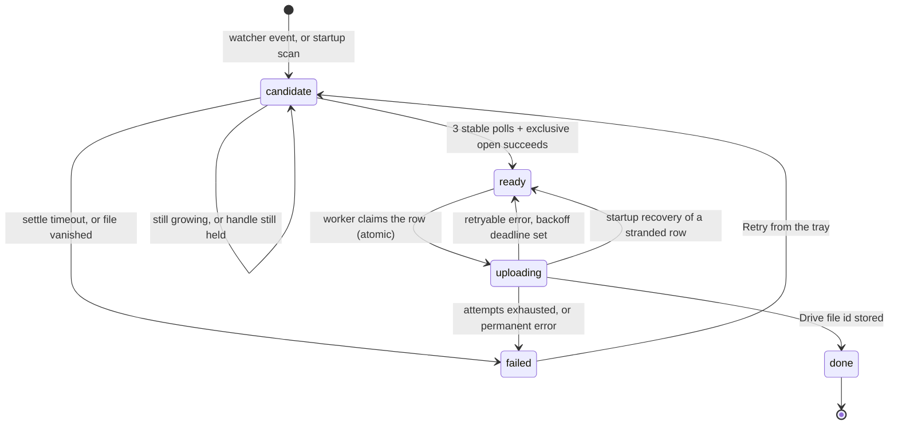

# climp

Watches the folder NVIDIA ShadowPlay saves clips into, waits until each clip is
genuinely finished writing, and uploads it to a Google Drive folder. Sits in the
system tray. You record a clip mid-game and it's on your phone a minute later.


---

## Why not just use Google Drive for Desktop

This was the first thing tried, and it is a reasonable question to ask before
reading any further.

**It deletes what you delete.** Drive for Desktop mirrors a folder. Clearing out
your local clips folder to reclaim disk space silently removes the copies in
Drive too — which is the opposite of what an archive is for. climp is one
directional by construction: nothing that happens locally propagates.

**It uploads while you're playing.** A 225 MB clip going up in the background
adds latency to the game that produced it. climp detects a fullscreen game
and holds uploads until you're done.

**Drive has no idea what a finished clip is.** ShadowPlay creates the `.mp4` on
the hotkey press, then flushes its replay buffer into it. Anything that reacts
to file creation sees a file that is not there yet. climp requires the size
to hold steady across three consecutive polls *and* an exclusive file handle to
succeed before it will touch a clip.

**No retention, and no answers.** 15 GB of free Drive is about 60 clips, and a
full Drive stops Gmail receiving mail. climp keeps a rolling window of the
newest N clips, and can tell you exactly what it uploaded, what failed, and why.

If none of those bother you, Drive for Desktop is genuinely simpler. They did.

---

## How it works

One clip is one row in one SQLite table. Five components each own one step of
moving that row forward. **No component calls another** — they communicate only
by writing a `state` value and reading it back.



| Component | File | Owns |
|---|---|---|
| Watcher | `watcher.py` | Filesystem events → `candidate` rows. Never reads the file |
| Settle checker | `settle.py` | Deciding a file is finished → `ready` |
| Reconciler | `reconciler.py` | One startup scan, so closing the app is safe |
| Upload worker | `uploader.py` | Draining `ready`, resumable uploads, backoff |
| Tray | `tray.py` | Showing the queue. Writes one thing: a retry |
| — | `db.py` | The schema, the connections, **every** SQL statement |
| — | `drive.py` | Google Drive. Knows nothing about states or rows |

The invariant worth protecting: **the queue is the source of truth, not the
folder.** The filesystem is read in exactly two places — watcher events and the
startup scan — and both can only ever produce a `candidate` row. Everything
else is a query against the table.

---

## Setup

Windows only. It relies on `CreateFile` share modes, DPAPI and a Windows shell
API, none of which have meaningful equivalents elsewhere.

### 1. Google Cloud

1. Create a project at [console.cloud.google.com](https://console.cloud.google.com),
   signed in as the account whose Drive should receive the clips.
2. Enable the **Google Drive API**.
3. Configure the OAuth consent screen. Audience **External**.
4. Add exactly one scope: `https://www.googleapis.com/auth/drive.file`.
   Never `drive`. The narrow scope means a bug in this app cannot reach
   anything it did not create itself.
5. Add your own address under **Test users**.
6. Create an OAuth client of type **Desktop app** and download the JSON.

> **On publishing.** Left in *Testing*, Google expires the refresh token every
> seven days and you re-sign-in weekly. Moving to *In production* stops that,
> and with only `drive.file` it triggers no verification review — but the
> console asks for a homepage and privacy policy URL. Worth doing once the repo
> is public; not worth blocking on.

### 2. Install

```powershell
git clone https://github.com/kipyrr/climp.git climp
cd climp
python -m venv .venv
.\.venv\Scripts\python.exe -m pip install -r requirements.txt
```

Put the downloaded client secret at:

```
%LOCALAPPDATA%\climp\client_secret.json
```

Outside the repo deliberately, so it cannot be committed by accident.

### 3. First run

```powershell
.\.venv\Scripts\python.exe -m climp.main
```

A browser opens once. You will see *"Google hasn't verified this app"* —
click **Advanced → Go to climp**. That is you authorising your own software.

It creates a Drive folder called **Game Clips**, writes
`%LOCALAPPDATA%\climp\config.toml`, and starts watching.

**Finding the icon.** Windows 11 hides new tray icons by default, so climp will
almost certainly *not* appear next to your clock on first run. Click the `^`
arrow to the left of the clock to open the hidden-icons panel, find the red
circle, and drag it down onto the taskbar to keep it visible. Until you do
that, a successful start looks exactly like nothing happening.

Only one copy runs at a time. Launching it again tells you it is already
running rather than starting a second one.

**If a launch ever appears to do nothing**, check
`%LOCALAPPDATA%\climp\logs\launch.log`. Every launch writes there before
anything else happens, so even an instant failure leaves a record, and any
error is also shown in a dialog.

### 4. Optional

```powershell
.\.venv\Scripts\python.exe tools\autostart.py --desktop   # Desktop icon
.\.venv\Scripts\python.exe tools\autostart.py --enable    # start at login
.\.venv\Scripts\python.exe tools\autostart.py --status
```

---

## Using it

Right-click the tray icon.

- **Queue summary** and Drive space left, expressed in clips rather than bytes.
- **Failed clips**, each with its actual error and its own Retry.
- **Clips from: …** — which folder is being watched, its full path, and how
  many `.mp4` files are in it. Choose a different folder and climp rescans it
  and starts watching it immediately; the choice is saved.
- **Keep in Drive** — retention. Off, or the newest 10 / 20 / 40 / 60 / 100.
  Choosing a number enables it. Nothing under 24 hours old is ever deleted,
  whatever you pick.
- **Open Drive folder**, **Open log file**, **Quit**.

The icon is a solid red circle. While there is work in the queue it pulses
smoothly from red to black and back, once every three seconds, and settles on
solid red when the queue empties.

### Existing clips are not uploaded

`backfill_since` in `config.toml` is set to the moment you first ran climp.
Anything older is ignored, so a folder with a large back catalogue does not
empty your Drive quota on first launch. Lower the value to pull older clips in;
the next startup scan will find them.

### Config

`%LOCALAPPDATA%\climp\config.toml`. Alongside it live `clips.db`, the
DPAPI-encrypted `token.bin`, and `logs\climp.log`.

The app was called ClipSync until 2026-09-16. An install from before the rename
has its data moved from `%LOCALAPPDATA%\ClipSync` automatically on first start,
so the token, database and settings all carry over.

---

## Things that are true and were not obvious

Each of these cost something to find out. They are here so the next person does
not have to.

**Setting `resumable_uri` does not resume an upload.** A rebuilt request starts
with its progress counter at zero, and the client library never asks the server
how much it already holds — so it re-sends the whole file under the old session.
The crash-recovery test passed while uploading 120 MB twice. `received_bytes()`
now queries the offset explicitly with `Content-Range: bytes */<total>`.

**A gate that cannot fail is not a gate.** "Kill it, restart, it finishes"
passes whether the upload resumes or silently restarts. `tools/gate_test.py`
asserts on the *resumed offset*, which is the only thing that distinguishes
them.

**Browsing your clips folder in Explorer fires modify events for old files.**
Seventeen clips from months earlier produced events at once. Anything treating
a watcher event as "this file is new" would queue the entire back catalogue.

**`open(path, 'rb')` is not a lock test on Windows.** It succeeds happily while
another process is writing. The real test is `CreateFile` with share mode `0`.

**Size stability alone is not enough.** ShadowPlay can pause while still holding
the handle. Both tests are required, not either.

**Path spellings defeat a unique index.** `watchdog` and `os.walk` do not always
agree on casing for the same file. Normalisation lives in exactly one function
in `db.py`; a second spelling would mean a second upload.

---

## Development

```powershell
.\.venv\Scripts\python.exe -m pip install -r requirements-dev.txt
.\.venv\Scripts\python.exe -m pytest tests -q
```

138 tests, no network, no quota spent. The Drive client is faked; the settle
checker's clock and filesystem are injected.

```powershell
# a fake ShadowPlay: grows, pauses while still holding the handle, releases
.\.venv\Scripts\python.exe tools\simulate_clip.py "C:\tmp\clips\G\test.mp4" --mb 12 --hold 8

# crash recovery, end to end against real Drive. Cleans up after itself.
.\.venv\Scripts\python.exe tools\gate_test.py --mb 120 --kill-after 18

# preview retention without deleting anything
.\.venv\Scripts\python.exe tools\retention_cli.py --keep 40
```

`--no-tray` runs headless with a console status line.

---

## Documents

- [`IMPLEMENTATION-PLAN.md`](IMPLEMENTATION-PLAN.md) — the build plan, and every
  decision with the reasoning behind it. Section 7 lists all nineteen.
- [`STATE.md`](STATE.md) — where the project is up to.
- [`docs/blueprint.md`](docs/blueprint.md) — the original architecture, kept
  unmodified as the source of truth.
