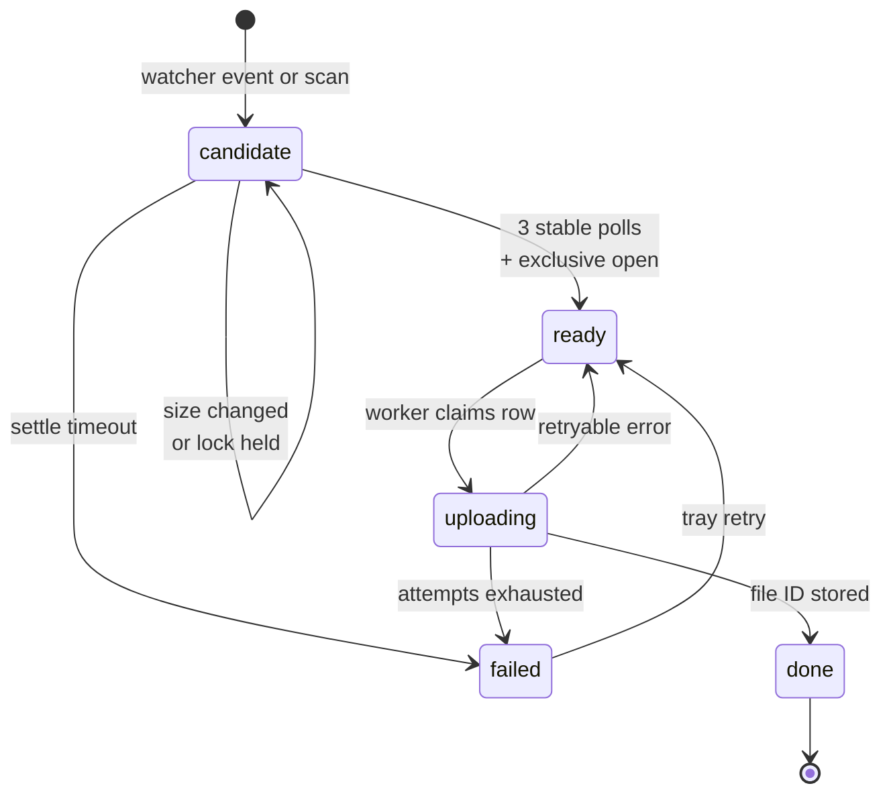

# Route B — Implementation Blueprint

2026-09-16 · @u_M6sqGiZ5GfwJgA1lEokOYw

This is the build plan for Route B — a Python watcher plus the Drive API — using the five-component architecture and the state table from the Clip Auto-Upload build plan as the source of truth. Nothing here adds a component or a feature that document did not already establish; gaps are listed as decisions, not filled in.

## 1. Overall operation

One clip is one row in one SQLite table, and every component's only job is to move that row from one state to the next. Nothing talks to anything else directly — components communicate by changing `state` and reading it back.

**Scope of this plan.** The architecture, state table, roadblocks, Drive specifics and phases below come from the build plan's "Five components" section onward. The stack names — `watchdog`, `google-api-python-client`, SQLite — come from that document's Route B section, since Route B is the option chosen.

### The path of one clip

1. You press the ShadowPlay hotkey. NVIDIA creates the `.mp4` at once, then spends seconds to a minute or more flushing the replay buffer into it.
2. The **Watcher** receives a filesystem event for that path and inserts a `candidate` row. It does not read the file's contents and never uploads.
3. The **Settle checker** polls that file every 2 seconds. It requires the size unchanged for 3 consecutive polls *and* an exclusive open to succeed. When both hold, the row becomes `ready`.
4. The **Upload worker** claims `ready` rows up to its concurrency limit, flips each to `uploading`, and starts a resumable upload into the app-created Drive folder. It persists the session URI on the row.
5. On success it writes `drive_file_id` and `drive_link`, then sets `done`. On failure it increments `attempts`, records `last_error`, and either schedules a backed-off retry or sets `failed`.
6. The **Tray UI** reads the table and shows what is in each state. Its retry button resets a `failed` row so the worker picks it up again.

The **Reconciler** sits outside that sequence. It runs once at startup, before the watcher starts, walks the clips folder recursively, and inserts any `.mp4` it does not already find in the database as a `candidate`. That single pass is what makes closing the app safe.

### What is running at once

Four loops live in one process: the watcher's event callback, the settle poll, the upload worker, and the tray's refresh. They never call each other. A clip can be settling while another is uploading and a third is already `done`, because each loop only queries the states it owns.

### The invariant to hold on to

The queue is the source of truth, not the folder. The folder is read in exactly two places — the watcher's events and the reconciler's startup scan — and both of them only ever produce `candidate` rows. Every other decision in the app is a query against the state table.

## 2. Coding architecture

Five components, five modules, plus one module that owns the database and one entry point that starts the loops. No component imports another component.

| Module | Component | Reads | Writes |
| --- | --- | --- | --- |
| `watcher.py` | Watcher | Filesystem events | `candidate` rows |
| `settle.py` | Settle checker | `candidate` rows; file size and lock state on disk | `size_bytes`, `mtime`, `ready` |
| `reconciler.py` | Reconciler | The clips folder tree; all existing `path` values | `candidate` rows |
| `uploader.py` | Upload worker | `ready` rows; `attempts`; the persisted session URI | `uploading`, `done`, `failed`, `attempts`, `last_error`, `drive_file_id`, `drive_link`, session URI |
| `tray.py` | Tray UI | Counts and rows in every state | Nothing except a retry reset on a `failed` row |
| `db.py` | — (the state table) | — | Owns the schema, the connection and every query |
| `main.py` | — (process entry) | Config file | Starts reconciler, then watcher, settle loop, upload worker, tray |

### Watcher — `watcher.py`

**Responsibility.** Turn filesystem events into `candidate` rows. Never upload. Never block.

**What it does.** Start a `watchdog` observer on the clips folder with `recursive=True`, because the folder is nested per game. On a create or modify event for a `.mp4`, debounce per path, then insert a `candidate` row. The insert must be idempotent: `INSERT ... ON CONFLICT(path) DO NOTHING`, since `watchdog` fires several events per file on Windows.

**Reads.** Only the event's path. It does not stat the file and does not open it — that is the settle checker's job.

**Writes.** One row, `path` plus `state='candidate'`. Nothing else.

**Communication.** The row is the message. The event callback must return immediately; anything slower than an insert belongs in another loop.

### Settle checker — `settle.py`

**Responsibility.** Decide that a file is finished, and promote it to `ready`.

**What it does.** Every 2 seconds, select all `candidate` rows. For each, stat the file and compare `size_bytes` against the stored value. Keep a count of consecutive unchanged polls. At 3 unchanged polls, attempt an exclusive open. Only when the size test *and* the exclusive open both pass does the row become `ready`. A hard timeout applies so a genuinely stuck file does not sit in `candidate` forever.

**Reads.** `candidate` rows, and each file's current size and lock state.

**Writes.** `size_bytes` and `mtime` on every poll, and the transition to `ready`.

**Communication.** Purely through state. It never notifies the upload worker; the worker finds `ready` rows on its own next pass.

**Where the consecutive-poll counter lives** is a decision, not something the source document settles. Two readings are consistent with it: keep the counter in memory in this module, or derive it from `size_bytes` plus `mtime` already on the row. The second survives a restart; the first is simpler.

### Reconciler — `reconciler.py`

**Responsibility.** Make the app survive being closed.

**What it does.** On startup, before the watcher is armed, walk the clips folder recursively. For every `.mp4`, insert a `candidate` row if that `path` is not already in the table. Rows already at `done` are left alone — that is what stops a restart from re-uploading everything.

**Reads.** The folder tree, and the full set of existing `path` values.

**Writes.** `candidate` rows only.

**Communication.** It hands nothing to anyone. It finishes, then `main.py` starts the other loops.

**Ordering matters.** Run it to completion before the watcher starts. Reversed, a file created during the scan can be missed by both.

### Upload worker — `uploader.py`

**Responsibility.** Drain `ready` rows with bounded concurrency and exponential backoff.

**What it does.** Claim a `ready` row and set it to `uploading` in the same transaction, so two workers cannot take the same row. Start a resumable upload with `MediaFileUpload(..., resumable=True)` into the folder ID from config, and persist the returned session URI on the row. On success, write `drive_file_id` and `drive_link` and set `done`. On failure, increment `attempts`, store `last_error`, and back off — truncated exponential, capped around 64 seconds, on 403 and 429.

**Reads.** `ready` rows, `attempts` for the backoff delay, and the stored session URI when resuming.

**Writes.** Every column except `path`.

**Communication.** State only. The tray sees its progress by reading the same rows.

**Drive access** can live in this module or in a thin client beside it. That is a file-layout choice, not a sixth component.

### Tray UI — `tray.py`

**Responsibility.** Show the queue. Keep it dumb.

**What it does.** On a timer, run one grouped count query and render it. The retry button resets a chosen `failed` row so the worker picks it up again.

**Reads.** Counts per state, plus `last_error` for display.

**Writes.** Only the retry reset. It never uploads, never deletes, never touches the filesystem.

### The state table as the source of truth

These are the columns the build plan defines, and they are the whole contract between components:

| Column | Purpose |
| --- | --- |
| `path` | Full path, unique index — the duplicate guard |
| `size_bytes`, `mtime` | Settle detection and change detection |
| `content_hash` | Optional; catches a re-recorded clip at the same path |
| `state` | `candidate` → `ready` → `uploading` → `done` / `failed` |
| `attempts`, `last_error` | Backoff decisions and the tray display |
| `drive_file_id`, `drive_link` | Written on success; proves the upload landed |

One column is required by the roadblock list but not named in that table: the persisted resumable session URI. Roadblock 5 says to keep it in the database so a resume survives an app restart. Add it as a column on the same row.

Ownership is strict — one writer per state:

| State | Set by | Acted on by |
| --- | --- | --- |
| `candidate` | Watcher, Reconciler | Settle checker |
| `ready` | Settle checker | Upload worker |
| `uploading` | Upload worker | Upload worker |
| `done` | Upload worker | Reconciler (skips it), Tray |
| `failed` | Upload worker | Tray (retry button) |

Design this table and write `db.py` before any upload code. Every later question — did this already upload, what failed last night, resume from where — is a query against it.

## 3. File and state lifecycle

Two edges on that diagram are read into the source document rather than stated by it, and both are flagged in section 7: where a settle timeout sends the row, and whether a retryable upload error returns the row to `ready`.

### A new file appears

ShadowPlay creates the `.mp4` on the hotkey press. `watchdog` raises a create event, possibly followed by several modify events for the same path. The watcher debounces per path and inserts one row: `path`, `state='candidate'`, `attempts=0`. The conflict clause on `path` absorbs the repeat events. Nothing reads the file yet.

### The file is still being written

On its next 2-second pass the settle checker stats the file and finds a size larger than `size_bytes` on the row. It writes the new size and `mtime`, resets the consecutive-unchanged count to zero, and leaves the row at `candidate`. This repeats for however long NVIDIA takes to flush the buffer. A create-event upload would ship a 0-byte or half-written file here; this is the step that prevents it.

### The file becomes stable

The size comes back identical three polls running. That alone is not enough — NVIDIA can pause while still holding the handle. The checker now tries to open the file exclusively. If the open fails, the file is not done: the row stays `candidate` and the size test keeps running.

### The file becomes ready

The exclusive open succeeds. The checker closes the handle immediately and sets `state='ready'`. If instead the hard timeout elapses first, the row leaves `candidate` without ever being promoted, so a stuck file cannot hold a slot forever.

### An upload begins

The upload worker selects `ready` rows, up to its concurrency limit. It claims one by setting `state='uploading'` in the same transaction as the select, so a second worker cannot take the same row. It opens a resumable upload against the configured folder ID and writes the returned session URI to the row before sending the first chunk. Chunks go up at 8–32 MB with a `Content-Range` header.

### An upload succeeds

Google returns the created file's metadata. The worker writes `drive_file_id` and `drive_link`, then sets `state='done'` — ideally in one transaction, so a crash between the two cannot leave a `done` row with no file ID. The row is now terminal. The reconciler will skip this path on every future startup.

### An upload fails

The worker catches the error, increments `attempts`, and writes the message into `last_error`. On a 403 or 429 it applies truncated exponential backoff capped around 64 seconds. On a dropped connection it does not restart from zero: it sends a zero-length `PUT` with `Content-Range: bytes */<total>`, reads how many bytes Google already has, and resumes from there. The session URI stays on the row, valid for about a week.

### A retry occurs

The backoff delay comes from `attempts`. Once it elapses, the worker picks the row up again and resumes against the stored session URI rather than starting a new upload. When `attempts` crosses the limit, the row becomes `failed` and stops being retried automatically. The tray's retry button is the only way back — it resets the row so the worker treats it as `ready` again.

### The application is closed and reopened

On shutdown, nothing needs to be flushed: every state change was already committed. On startup, in order:

1. `db.py` opens the database and applies the schema if it is missing.
2. The reconciler walks the clips folder and inserts a `candidate` row for any `.mp4` not already present. Rows at `done` are skipped, which is what stops a re-upload of everything.
3. Rows left at `uploading` by the crash are picked back up and resumed from the persisted session URI. The source document requires this behaviour — Phase 2 is only done when killing the app mid-upload and restarting finishes the job — but does not say which component performs the recovery. The upload worker is the natural owner, since it owns the `uploading` state and the session URI.
4. The watcher starts. Anything created from this moment arrives as an event; anything created before it is already a row.
5. The settle loop, upload worker and tray start.

A file created *during* step 2 is the one gap: the scan may have passed its folder before it existed, and the watcher is not armed yet. It is caught on the next restart, or by a periodic rescan if you decide to add one.

## 4. Potential roadblocks

These are the eight route-independent roadblocks from the build plan, plus the four the document lists as specific to Route B. Nothing is invented here, and no roadblock below is answered with a new component.

### 1. Knowing when the file is finished

- **Cause.** There is no completion signal. NVIDIA creates the `.mp4` on the hotkey and flushes the buffer into it afterwards.
- **Where.** Settle checker, and by extension anything that trusts a `ready` row.
- **Effect.** A 0-byte or half-written clip uploaded and marked `done`, which the duplicate guard then prevents you from ever re-uploading.
- **Architecture.** This is exactly why the settle checker exists as its own component and why `candidate` is a separate state from `ready`.
- **Code.** Poll size every 2 seconds, require it unchanged for 3 consecutive polls, *and* require an exclusive open to succeed. Both, not either. Add a hard timeout so a stuck file leaves `candidate`.

### 2. Free Drive storage is 15 GB, shared with Gmail and Photos

- **Cause.** A 1080p60 clip at 50 Mbps is roughly 375 MB per minute — about 40 one-minute clips before the account is full.
- **Where.** Upload worker, as a hard API error once the quota is gone.
- **Effect.** Uploads fail permanently, and Gmail stops receiving mail. The document calls this the constraint most likely to actually bite.
- **Architecture.** Nothing in the five components handles it. The document's two options are paying for 100 GB or building the retention policy, which it places in Phase 4.
- **Code.** Until Phase 4, make the quota error land in `last_error` in a form the tray shows plainly, so a full Drive is visible rather than a silent stream of failures.

### 3. OAuth "Testing" mode expires the refresh token every 7 days

- **Cause.** A Google Cloud OAuth app left with its audience set to Testing.
- **Where.** Auth, at the first upload after expiry.
- **Effect.** The app stops working roughly weekly with no obvious reason.
- **Architecture.** Not an architecture problem. It is a console setting, and the document puts it in the Phase 0 setup list.
- **Code.** None. Set the audience to **In production** on day one. `drive.file` is non-sensitive, so publishing does not trigger a verification review — you click through one unverified-app warning.

### 4. Uploading while you are still playing

- **Cause.** A 400 MB upload saturating a home connection.
- **Where.** Upload worker.
- **Effect.** Added latency in whatever you are playing — the app actively degrading the thing it exists to record.
- **Architecture.** The worker's bounded concurrency is the hook. Because it decides when to claim a `ready` row, deferring is a condition on that claim, not a new component.
- **Code.** Phase 4. Either a bandwidth cap or detect a fullscreen game and hold `ready` rows until it exits. The document calls deferring the easier and likelier choice.

### 5. Network loss mid-upload

- **Cause.** Home Wi-Fi drops, or the PC sleeps.
- **Where.** Upload worker, mid-transfer.
- **Effect.** A plain multipart upload restarts from zero — painful at 400 MB.
- **Architecture.** Resumable uploads are named in the upload worker's definition, and the session URI is persisted on the row so resumption survives an app restart, not just a retry.
- **Code.** Write the session URI to the row before the first chunk. On failure, `PUT` a zero-length body with `Content-Range: bytes */<total>` to learn the received byte count and resume there. Session URIs last about a week.

### 6. Duplicate uploads

- **Cause.** The watcher fires several events for one file, or a restart re-scans the folder.
- **Where.** Watcher and reconciler, both of which insert `candidate` rows.
- **Effect.** Three copies of the same clip in Drive. The document names this the most common failure of naive versions.
- **Architecture.** The unique index on `path` plus the `done` state. Both inserting components go through the same guarded insert.
- **Code.** `INSERT ... ON CONFLICT(path) DO NOTHING` in the watcher and the reconciler, debounce per path in the watcher, and confirm the Drive file ID exists before trusting a `done` row.

### 7. Windows sleep and hibernate

- **Cause.** The process is suspended mid-upload and wakes to a dead socket.
- **Where.** Upload worker.
- **Effect.** Rows stranded at `uploading` against connections that no longer exist.
- **Architecture.** Same recovery path as a crash — rows at `uploading` resume from the persisted session URI.
- **Code.** Subscribe to power events, or take the document's simpler option: treat every wake as "assume connections are dead, retry from the queue."

### 8. API rate limits

- **Cause.** 403 and 429 responses from Drive.
- **Where.** Upload worker.
- **Effect.** Realistically none — Drive allows 12,000 queries per minute per user and you will do a handful per clip.
- **Architecture.** Covered by the exponential backoff already in the worker's definition.
- **Code.** Truncated exponential backoff on 403 and 429, capped around 64 seconds. Ten lines, and the document notes it is what a reviewer looks for.

### Route B specifics

These four come from the document's Route B section rather than the route-independent list.

- **`watchdog` fires multiple events per file on Windows.** In the watcher. Treat every event as "check this file," never "upload this file," and debounce per path — which is already what inserting a `candidate` row means.
- **A PyInstaller build gets flagged by Defender.** At packaging, in Phase 3. Ship a folder build with `--onedir` rather than `--onefile`, or run from source with a Task Scheduler entry.
- **The OAuth refresh token sits in plaintext JSON.** In auth, on disk. Encrypt it with DPAPI via `win32crypt.CryptProtectData`. Keep the client secret JSON out of git.
- **Memory creeps over weeks of uptime.** Across the long-running loops. Bound the queue, close file handles explicitly — the settle checker's exclusive open in particular — and log RSS once an hour.

## 5. Implementation order

The six phases below are the build plan's, with the Route B modules mapped onto them and a test gate on each. Each phase ends with something usable on its own.

| Phase | Modules written | Depends on | Gate before moving on |
| --- | --- | --- | --- |
| 0. Spike | throwaway script, auth | Google Cloud console setup | A clip you picked by hand appears in Drive |
| 1. Walking skeleton | `watcher.py`, `settle.py`, first `uploader.py` | Phase 0's working auth | You clip in-game and it lands in Drive untouched |
| 2. Durability | `db.py`, `reconciler.py`, rewritten `uploader.py` | The state table designed first | Kill the app mid-upload, restart, it finishes |
| 3. Livable | `tray.py`, `config.py`, `main.py`, logging | Phase 2's queue | It has run a week and you forgot it exists |
| 4. Hardening | defer-or-cap, retention, power events | A queue the worker can hold back | Survives a month of sleep cycles, does not fill Drive |
| 5. Polish | tests, README, CI | Everything above | A stranger can read the repo and follow the decisions |

### Phase 0 — spike

Start here today. The OAuth setup is the least enjoyable part and every later phase depends on it.

1. Create the Cloud project, enable the Drive API, configure the consent screen as External.
2. Add only the `drive.file` scope. Never request `drive`.
3. **Publish the app — set the audience to In production.** Skipping this is roadblock 3.
4. Create an OAuth client ID of type Desktop app, so you get the loopback redirect and need no web server.
5. Download the client secret JSON and keep it out of git.
6. Write a throwaway script: authenticate once, create the "Game Clips" folder via `files.create` with `mimeType: application/vnd.google-apps.folder`, save the folder ID, upload one hand-picked clip into it.

Do not write watcher code until a file you chose by hand is sitting in Drive.

### Phase 1 — walking skeleton

Watcher, settle logic and upload wired together in memory, with no database yet. Build in this order, because each piece is only testable once the one before it works:

1. `watcher.py` printing paths. Clip in-game, confirm you get an event and see how many.
2. `settle.py` operating on an in-memory dict. This is where the real bugs live.
3. Call the Phase 0 upload code from the settle checker's promotion point.

**Write the settle checker's unit test here**, not later. Feed it a fake file that grows, then stops growing, then gets released, and assert it only reports ready at the last moment. That logic misbehaves mid-game, where you cannot debug it.

### Phase 2 — durability

Design the state table before writing anything in this phase, including the rewritten uploader. The Phase 0 spike is allowed to predate it because it is throwaway; nothing that survives is.

1. `db.py` — schema, unique index on `path`, and one function per state transition. No SQL anywhere else.
2. Point `watcher.py` and `settle.py` at `db.py` instead of the in-memory dict.
3. `reconciler.py`, and the startup order in `main.py`: reconcile fully, then arm the watcher.
4. Rewrite `uploader.py` as a queue drainer: claim-and-mark in one transaction, resumable upload, session URI persisted before the first chunk, backoff from `attempts`, terminal `done` or `failed`.
5. Startup recovery for rows left at `uploading`.

The gate is the document's own: kill the app mid-upload, restart, and watch it finish the job rather than start over.

### Phase 3 — make it livable

`tray.py` reading counts, a config file for the clips folder and the Drive folder ID, launch at login, structured logs. The tray is last among these because it is a view over a queue that must already be correct. Packaging with `--onedir` belongs here too.

### Phase 4 — hardening

Defer-while-gaming or a bandwidth cap, the retention policy, and power-event handling. All three attach to components that already exist: the first two are conditions on the worker's claim, retention is a Drive-side sweep over `done` rows, and power handling is the existing retry path triggered on wake.

### Phase 5 — polish

README with the architecture diagram, tests around the settle logic, a GitHub Actions build. The document's own framing for the README is worth keeping: explain why off-the-shelf sync was insufficient.

A realistic pace in Python is faster than the document's C# estimate, but the ordering does not change.

## 6. Testing and failure scenarios

Most of these are forced by hand rather than unit-tested. The one that belongs in a real test file is the settle checker, which the build plan singles out.

### Clips lost

| Scenario | How to force it | Pass condition |
| --- | --- | --- |
| App closed while clips exist | Close the app, record two clips, reopen | Reconciler enqueues both as `candidate` |
| Crash mid-upload | Kill the process during a large upload, restart | Row resumes from the session URI and reaches `done` |
| Event missed entirely | Copy an `.mp4` into the folder while the app is stopped | Next startup's scan catches it |
| File created during the startup scan | Drop a file into an already-scanned folder mid-reconcile | Documented gap — confirm it is caught on the next restart |

### Clips duplicated

| Scenario | How to force it | Pass condition |
| --- | --- | --- |
| Multiple `watchdog` events for one file | Record one clip, log every raw event | Exactly one row exists for that path |
| Restart after success | Restart with many `done` rows | Zero new uploads; Drive file count unchanged |
| Watcher and reconciler racing | Start the app with clips already present and record immediately | Still one row per path — the unique index holds |
| Two workers claiming one row | Raise concurrency, fill the queue | Never two `uploading` claims on the same path |

### Clips uploaded incorrectly

| Scenario | How to force it | Pass condition |
| --- | --- | --- |
| Half-written file promoted | Record a long clip and watch the state during the flush | Row stays `candidate` for the whole flush |
| Size stable but handle still held | Unit test: grow the file, stop, keep it locked, then release | `ready` only after the release |
| Upload of a 0-byte file | Create an empty `.mp4` in the folder | Never promoted, or fails the settle timeout |
| Wrong Drive folder | Delete the folder ID from config | Clear error, not a silent upload to Drive root |

### Clips permanently stuck

| Scenario | How to force it | Pass condition |
| --- | --- | --- |
| A file that never settles | Hold an open handle on a clip indefinitely | Hard timeout fires; the row leaves `candidate` |
| Rows stranded at `uploading` | Kill the process mid-upload | Recovered at startup, not left mid-state forever |
| Attempts exhausted | Point the app at an invalid folder ID | Row reaches `failed` with a readable `last_error` |
| Retry button | Press retry on a `failed` row after fixing the cause | Row re-enters the queue and completes |
| Drive full | Fill the quota, or test against a full account | Quota error surfaces in the tray, not a silent retry loop |

### State table misrepresenting reality

| Scenario | How to force it | Pass condition |
| --- | --- | --- |
| `done` with no Drive file | Delete the file in Drive, restart | `drive_file_id` is verified before the row is trusted |
| `done` written without the file ID | Crash between the two writes | Impossible — both land in one transaction |
| Clip re-recorded at the same path | Overwrite an uploaded clip with a new recording | Caught by `content_hash`, or accepted as a known gap if you skip that column |
| Tray disagreeing with the table | Watch the tray during a busy queue | Counts converge within one refresh; the tray never writes |

### Longevity

Two checks that only fail over time: leave the app running for a week and compare RSS against the hourly log, and let the machine sleep and wake mid-upload to confirm the queue recovers rather than stalling on a dead socket.

## 7. Open decisions

These are places the build plan defines a requirement but not a mechanism. Each is a choice to make deliberately rather than discover in code.

| Decision | What the document says | Decide by |
| --- | --- | --- |
| Where a retryable upload failure sends the row | Lists `candidate` → `ready` → `uploading` → `done` / `failed`, and requires backoff, but not the retry edge | Phase 2 |
| Where a settle timeout sends the row | "Add a hard timeout so a genuinely stuck file doesn't sit forever" — no destination state | Phase 1 |
| How long that timeout is | Not specified | Phase 1 |
| How many attempts before `failed` | Backoff is capped around 64 seconds; the attempt ceiling is not given | Phase 2 |
| Where the consecutive-unchanged counter lives | Requires 3 unchanged polls; does not say whether the count is in memory or derived from the row | Phase 1 |
| The session URI column | Requires persisting it in the database; not present in the column list | Phase 2, alongside the schema |
| Whether to implement `content_hash` | Marked optional; it is the only defence against a clip re-recorded at the same path | Phase 2, when the schema is fixed |
| Upload concurrency | The architecture diagram says 1–2 concurrent | Phase 2 |
| Whether the retry button resets `attempts` | The button is defined; its effect on the counter is not | Phase 3 |
| Catching a file created during the startup scan | Not addressed; a periodic rescan would close it but is not in the design | Phase 2, or accept the gap |
| Where the database, config and token file live on disk | Only constraint given: the token path cannot sit inside the PyInstaller bundle | Phase 3 |
| What "newest" means for retention | The document flags this as part of what makes retention interesting | Phase 4 |

The first two are worth settling before you write any state-transition code, because every other component reads the states they produce.

---

**Sources** — carried from the build plan, and the three pages this plan relies on directly.

- [Test vs. production app audience — Google Cloud Help](https://support.google.com/cloud/answer/15549945?hl=en)
- [Drive API usage limits](https://developers.google.com/workspace/drive/api/guides/limits)
- [Choose Google Drive API scopes](https://developers.google.com/workspace/drive/api/guides/api-specific-auth)
